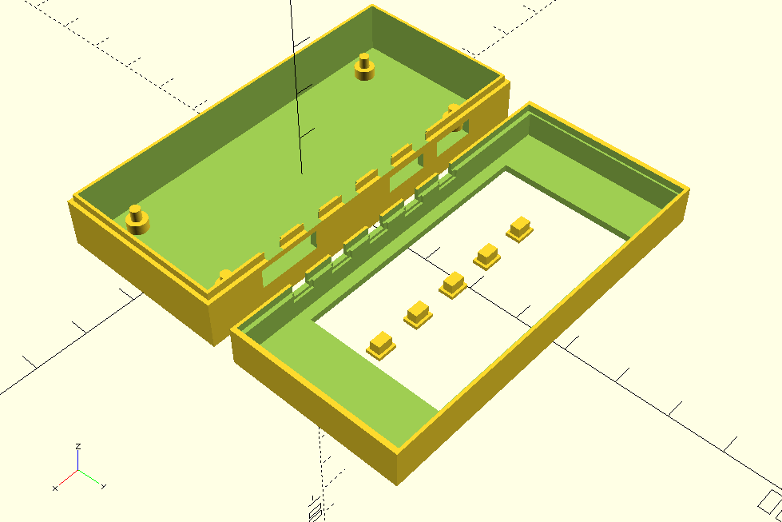

# papirus_zero_case

[OpenSCAD](http://www.openscad.org/) file of a case for a Raspberry Pi Zero plus PaPiRus Zero ePaper pHAT

## Instructions

* For print mode (enabled by default) uncomment `print();` at the end of the file
* For dev mode comment out `print();` and uncomment `dev();` instead

## Content

* `papirus_zero_case.scad`: OpenSCAD model of a case for [PaPiRus Zero - ePaper / eInk Screen pHAT for Pi Zero](https://uk.pi-supply.com/products/papirus-zero-epaper-screen-phat-pi-zero) 

## Credits

Based on model library from Saarbastler:
 * https://github.com/saarbastler/library.scad